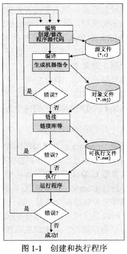
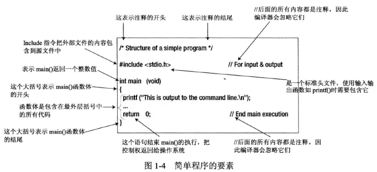

# C 语言基础知识汇总

## 一. 学好 C 语言的运算符和运算顺序

​	这是学好 C 语言的基础,C 语言的运算非常灵活,功能十分丰富,运算种类远多于其他程序设计语言.

​	在表达式方面较其他程序语言更为简洁,如自加,自减,逗号运算和三目运算使表达式更为简单,但初学者往往会觉得这种表达式难读,关键原因就是对运算符和运算顺序理解不透不全.

​	当多种不同运算符组成一个运算表达式,即一个运算式中出现多种运算符时,运算的优先顺序和结合规则显得十分重要.

​	在学习中,只要我们对此合理进行分类,找出它们与我们在数学中所学到运算之间的不同点之后,记住这些运算也不是难事,有些运算符在理解后更会牢记心中,将来用起来得心应手,而有些可暂时放弃不记,等用到时再记不迟.

​	先明确运算符优先级不同分类,C 语言运算符可分为15种优先级,从高到低,优先级为1~15,除第2,3级和第14级为从右至左结合外,其它都是从左至右结合,它决定同级运算符的运算顺序.

## 二. 学好 C 语言的四种程序结构

### 1. 顺序结构

​	顺序结构的程序设计是最简单的,只要按照解决问题的顺序写出相应的语句就行,它的执行顺序是自上而下,依次执行.

​	例如:

```c
a = 3;
b = 5;
```

​	现交换a,b的值,这个问题好像交换两杯水,当然要用到第三个杯子,假如第三个杯子是c,那么正确的程序为:

```c
c = a;
a = b;
b = c;
```

​	执行结果是a = 5,b = c = 3

​	如果改变其顺序,写成:

```c
a = b;
c = a;
b = c;
```

​	则执行结果就变成a = b = c = 5,不能达到逾期的目的,初学者最容易犯这种错误.

​	顺序结构可以独立使用构成一个简单完整的程序,常见的输入,计算,输出三部曲的程序就是顺序结构,例如计算圆的面积,其程序的语句顺序就是输入圆的半径,计算s = 3.14159 * r * r,输出圆的面积s.

​	不过大多数情况下顺序结构都是作为程序的一部分,与其它结构一起构成一个复杂的陈旭,例如分支结构中的符合语句,循环结构中的循环体等.

### 2. 分支结构

​	顺序结构的程序虽然能解决计算,输出等问题,但不能做判断再选择,对于要先做判断再选择的问题就要使用分支结构.

​	分支结构的执行时依据一定的条件选择执行路径,而不是严格按照语句出现的物理顺序.分支结构的程序设计方法的关键在于构造合适的分支条件和分析程序流程,根据不同的程序流程选择适当的分支语句.

​	分支结构适于带有逻辑或关系比较等条件判断的计算,设计这类程序时往往都要先绘制其程序流程图,然后根据程序流程图写出源程序,这样做把程序设计分析与语言分开,使得问题简单化,易于理解.

​	程序流程图是根据解题分析所绘制的程序执行流程图.

​	学习分支结构不要被分支嵌套所迷惑,只要正确绘制出流程图,弄清各分支所要执行的功能,嵌套结构也就不难了,嵌套只不过是分支中又包括分支语句而已,不是新知识,只要对双分支的理解清楚,分支嵌套是不难的.

<font color='cornflowerblue'>**下面介绍几种基本的分支结构:**</font>

​	<font color='cornflowerblue'>①if语句</font>

```c
if(条件)
{
    分支体;
}
```

​	这种分支结构中的分支体可以是一条语句,此时"{}"可以省略,也可以是多条语句即复合语句,它有两条分支路径可选,一条是当条件为真,执行分支体,否则跳过分支体,这时分支体就不会执行.如:要计算x的绝对值,根据绝对值的定义,我们知道,当x>=0时,其绝对值不变,而x<0时其绝对值是x的反号,因此程序段为:

```c
if(x<0)x=-x;
```

​	<font color='cornflowerblue'>②if...else语句</font>

```c
if(条件)
{分支1;}
else
{分支2;}
```

​	这是典型的分支结构,如果条件成立,执行分支1,否则执行分支2,分支1和分支2都可以是1条或若干条语句构成.如:求ax^2^+bx+c=0的根,分析:因为当b^2^-4ac>=0时,方程有两个实根,否则b^2^-4ac<0有两个共轭复根.其程序段如下:

```c
d=b*b-4ac;
if(d>=0)
{
    x1=(-b+sqrt(d))/2a;
    x2=(-b-sqrt(d))/2a;
    printf("x1=%8.4f,x2=%8.4f\n",x1,x2);
}
else
{
    r=-b/(2*a);
    i=sqrt(-d)/(2*a);
    printf("x1=%8.4f+%8.4f*i\n",r,i);
    printf("x1=%8.4f-%8.4f*i\n",r,i);
}
```

​	<font color='cornflowerblue'>③嵌套分支语句:其语句格式为:</font>

```c
if(条件1){分支1};
else if(条件2){分支2}
else if(条件3){分支3}
...
else if(条件n){分支n}
else{分支n+1}
```

​	嵌套分支语句虽然可解决多个入口和出口的问题,但超过3重嵌套后,语句结构变得非常复杂,对于程序的阅读和理解都极为不变,建议嵌套在3重以内,超过3重可以用下面的语句.

​	<font color='cornflowerblue'>④switch开关语句:</font>

​	该语句也是多分支选择语句,到底执行哪一块,取决于开关设置,也就是表达式的值与常量表达式相匹配的那一路.

​	它不同于if...else 语句.它的所有分支都是并列的.程序执行时,由第一分支开始查找,如果相匹配,执行其后的块,接着执行第2分支,第3分支...的块,直到遇到break语句;如果不匹配,查找下一个分支是否匹配.

​	这个语句在应用时要特别注意开关条件的合理设置以及break语句的合理应用.

### 3. 循环结构

​	循环结构可以减少源程序重复书写的工作量,用来描述重复执行某段算法的问题,这是程序设计中最能发挥计算机特长的程序结构,C 语言中提供四种循环,即goto循环,while循环,do...while循环和for循环.

​	四种循环可以用来处理同一问题,一般情况下它们可以互相代替,但一般不提倡用goto循环,因为强制改变程序的顺序经常会给程序的运行带来不可预料的错误,在学习中我们主要学习其它三种循环.

​	常用的三种循环结构学习的重点在于弄清它们相同与不同之处,以便在不同场合下使用,这就要清楚三种循环的格式和执行顺序,将每种循环的流程图理解透彻后就会明白如何替换使用.

​	如把while循环的例题,用for语句重新编写一个程序,这样能更好地理解它们的作用.特别要注意在循环体内应包含趋于结束的语句(即循环变量值的改变),否则就可能成了一个死循环,这是初学者一个常见错误.

​	学完这三个循环后,应明确它们的异同点:用while和do...while循环时,循环变量的初始化的操作应在循环体之前,而for循环一般在语句1中进行;

​	while循环和for循环都是先判断表达式,后执行循环体,而do...while循环是先执行循环体后判断表达式,也就是说do...while的循环体最少被执行一次,而while和for就可能一次都不执行.

​	另外还要注意的是这三种循环都可以用break语句跳出循环,用continue语句结束本次循环,而goto语句与if构成的循环,是不能用break和continue语句进行控制的.

​	顺序结构,分支结构和循环结构并不是彼此孤立的,在循环中可以有分支,顺序结构,分支中也可以由循环,顺序结构.其实不管那种结构,我们均可广义的把它们看成一个语句.

​	在实际编程过程中常将这三种结构互相结合以实现各种算法,设计出相应程序,但要变成的问题较大,编写出的程序就往往很长,结构重复多,造成可读性差,难以理解,解决这个问题的方法是将C 程序设计成模块化结构.

### 4. 模块化程序结构

​	C 语言的模块化程序结构用函数来实现,即将复杂的C程序分为若干模块,每个模块都编写一个C函数,然后通过主函数调用函数及函数调用函数来实现一大型问题的C程序编写.

​	因此常说:C程序 = 主函数+子函数.因此,对函数的定义,调用,值的返回等中要尤其注重理解和应用,并通过上机调试加以巩固.

## 三. 掌握一些简单的算法

​	编程其实一大部分工作就是分析问题,找出解决问题的方法,再以相应的编程语言写出代码.这就要求掌握算法,只要我们掌握一些简单的算法,在掌握这些基本算法后,要完成对问题的分析就容易了.

​	如两个数的交换,三个数的比较,选择法排序和冒泡法排序,这就要求我们要清楚这些算法的内在含义.

​	当我们把握好上述几方面后,只要能克服畏难,厌学,专心学习,做好练习与上机动手写代码,其实C语言并不难学.

# C 语言入门经典

## 第 1 章 C 语言编程

### 1.1 C 语言

​	C 语言相当灵活,用于执行计算机程序能完成的几乎所有任务,包括会计应用程序,字处理程序,游戏,操作系统等.它不仅是更高级语言(C++)的基础,目前还以 Objective C 的形式开发手机应用程序.Objective C 是标准的 C 加上一小部分面向对象编程功能.C 很容易学习,因为它很简洁.

### 1.2 标准库

​	C 的标准库也在 C11 标准中指定.标准库定义了编写 C 程序时常常需要的常量,符号和函数,它还提供了基本 C 语言的一些可选扩展.取决于及其的特性,例如计算机的输入输出,由标准库以不依赖及其的形式出现.这意味着,在 PC 中用 C 代码把数据写入磁盘文件的方式,与在其他计算机上相同,尽管底层的硬件处理相当不同.库提供的标准功能包括大多数程序员都可能需要的功能,例如处理文本字符串或数学计算,这样就免除了自己实现这些功能所需的大量精力.

​	标准库在一系列标准文件--头文件中指定.头文件的扩展名总是.h.为了使一组标准功能可用于 C 程序文件,只需将对应的标准头文件包含进来. 

### 1.3 学习 C

​	如果对编程非常陌生,则不需要学习 C 的某些方面,至少在刚开始时不需要学习.这些功能比较特殊,或者不大常用.本书把它们放在第 14 章,读者可以在熟悉其他内容后,再学习它们.

​	建议读者自己输入本书中的所有示例,即使它们非常简单,也要输入.自己亲自输入,以后就不容易忘记.不要害怕用代码进行实验.犯错对于编程而言非常有教育性.早期犯得错误越多,学到的东西就越多.

### 1.4 创建 C 程序

​	C 程序的创建过程有 4 个基本步骤或过程:

- 编辑
- 编译
- 链接
- 执行

​	这些过程很容易完成,首先介绍每个过程,以及它们对创建 C 程序的作用.

#### 1.4.1 编辑

​	编辑过程就是创建和修改 C 程序的源代码--我们编写的程序指令称为源代码.有些 C 编译器带一个编辑器,可帮助管理程序.通常,编辑器是提供了编写,管理,开发与测试程序的环境,有时也称为集成开发环境(Integrated Development Environment,IDE).

​	也可以用一般的文本编辑器来创建源文件,但它们必须将代码保存为纯文本,而没有嵌入附加的格式化数据.不要使用字符处理器,字处理器不适合编写程序代码,因为它们在保存文本时,会附加一些格式化信息.一般来说,如果编译器系统带有编辑器,就会提供很多便于编写及组织程序的功能.它们通常会自动编排程序文本的格式,并将重要的语言元素以高亮颜色显示,这样不仅让程序容易阅读,还容易找到单词输入错误.

​	在 Linux 上,最常用的文本编辑器是 Vim 编辑器,也可以使用 GNU Emacs 编辑器.对于 Microsoft Windows,可以使用许多免费(freeware)或共享(shareware)的程序设计编辑器.这些软件提供了许多功能,例如,高亮显示特殊的语法及代码自动缩进等功能,帮助确保代码是正确的.Emacs 编辑器也有 Microsoft Windows 版本.UNIX 环境的 Vi 和 Vim 编辑器也可用于 Windows,甚至可以使用 Notepad++.

​	当然,也可以够慢支持 C 语言的专业编程开发环境,例如微软或 Borland 的相关产品,它们能大大提高代码编辑能力.不过,在付款之前,最好检查一下它们支持的 C 级别是否符合当前的 C 语言标准 C11.因为现在很多产品主要面向 C++ 开发人员,C 语言只是一个次要目标.

#### 1.4.2 编译

​	编译器可以将源代码转换成机器语言,在编译的过程中,会找出并报告错误.这个阶段的输入是在编辑期间产生的文件,称为源文件.

​	编译器能找出程序中很多无效或无法识别的错误,以及结构错误,例如程序的某部分永远不会执行.编译器的输出结果称为对象代码(object code),存放它们的文件称为对象文件(object file),这些文件的扩展名在 Microsoft Windows 环境中通常是.obj,在 Linux/UNIX 环境中通常是.o.编译器可以在转换过程中找出几种不同类型的错误,它们大都会阻止对象文件的创建.

​	如果编译成功,就会生成一个文件,它与源文件同名,但扩展名是.o 或者.obj.

​	如果在 UNIX系统下工作,在命令行上编译 C 程序的标准命令是 cc(若编译器是 GNU's Not UNIX(GNU),则命令为.gcc).下面是一个示例:

```
cc -c myprog.c
```

​	其中,myporg.c 是要编译的程序,如果省略的 -c 这个参数,程序还会自动链接.成功编译的结果是生成一个对象文件.

​	大多数 C 编译器都有标准的编译选项,在命令行(如 cc myprog.c)或集成开发环境下的菜单选项(Compile 菜单选项)里都可以找到.在 IDE 中编译常常比使用命令行容易得多.

​	编译过程包括两个阶段.第一个阶段称为预处理阶段,在此期间会修改或添加代码,第二个阶段是生成对象代码的实际编译过程.源文件可以包含预处理宏,它们用于添加或修改 C 程序语句.

#### 1.4.3 链接

​	链接器(linker)将源代码文件中由编译器产生的各种对象模块组合起来,再从 C 语言提供的程序库中添加必要的代码模块,将它们组合成一个可执行的文件.链接器也可以检测和报告错误,例如,遗漏了程序的某个部分,或者引用了一个根本不存在的库组件.

​	实际上,如果程序太大,可将其拆成几个源代码文件,再用链接器连接起来.因为很难一次编写一个很大的程序,也不可能只使用一个文件.如果将它拆成多个小源文件,每个源文件提供程序的一部分功能,程序的开发就容易多了.这些源文件可以分别编译,更容易避免简单输入错误的发生.再者,整个程序可以一点一点地开发,组成程序的源文件同城会用一个项目名称集成,这个项目名称用于引用整个程序.

​	程序库提供的例程可以执行非 C 语言的操作,从而支持和扩展了 C 语言.例如,库中包含的例程支持输入,输出,计算平方根,比较两个字符串,或读取日期和时间信息等操作.

​	链接阶段出现错误,意味着必须重新编辑源代码;反过来,如果链接成功就会产生一个可执行文件,但这并不一定表示程序能正常工作.在 Microsoft Windows 环境下,这个可执行文件的扩展名为.exe;在 UNIX 环境下,没有扩展名,但它是一个可执行的文件类型.多数 IDE 也有 Build(建立)选项,它可一次完成程序的编译和链接.

#### 1.4.4 执行

​	执行阶段就是当成功完成了前述 3 个过程后,运行程序.但是,这个阶段可能会出现各种错误,包括输出错误及什么也不做,甚至使计算机崩溃.不管出现那种情况,都必须返回编辑结算,检查并修改源代码.

​	在这个阶段,计算机最终会精确地执行指令.在 UNIX 和 Linux 下,只要键入编译和链接后的文件名,即可执行程序.在大多数 IDE 中,都有一个相应的菜单命令来运行或者执行已编译的程序.这个 Run 命令或者 Execute 命令可能有自己的菜单,也可能位于 Compile 菜单项下.在 Windows 环境中,运行程序的.exe文件即可,这与运行其他可执行程序一样.

​	在任何环境及任何语言中,开发程序的编辑,编译,链接与执行这 4 个步骤都是一样的.图 1-1 总结了创建 C 程序的各个过程.



### 1.5 创建第一个程序

​	本节先浏览一下创建 C 语言程序的流程,从输入代码到执行程序的所有 4 个步骤.这个阶段,若不了解键入的代码信息,别担心,笔者会解释每一个步骤.

==试试看: C 程序示例==

```c
/* Program 1.1 Your Vrey First C program - Displaying Hello World */
#include <stdio.h>
int main()
{
    printf("Hello World!");
    return 0;
}
```

​	输入了上面的源代码后,将程序保存为 hello.c.可以用任意名字代替 hello,但扩展名必须是.c.这个扩展名在编写 C 程序时是一个通用的约定,他表示文件的内容是 C 语言源代码,大多数 C 编译器都要求源文件的扩展名是.c,否则编译器会拒绝处理它.

​	下面编译程序,链接所有必要的内容,创建一个可执行程序.编译和链接一般在一个操作中完成,通常称为"构建操作".源代码编译成功后,链接器就添加程序需要的标准库代码,为程序创建一个可执行文件.

​	最后,执行程序,这有几种方式,在 Windows 环境下,一般只需要在 Windows Explorer 中双击.exe 文件,但最好打开一个命令窗口,输入执行它的命令,因为在程序执行完毕后,显示输出的窗口就会小时.在所有的操作系统环境上,都可以从命令行上运行程序,只需要启动一个命令行会话,把当前目录改为包含程序可执行文件的目录,再输入程序名,就可以打开它了.

​	如果没有出现错误,就大功告成了.这个程序在屏幕上输出如下信息:

> Hello World!

### 1.6 编辑第一个程序

​	我们可以修改程序,在屏幕上输出其他信息,例如可以将程序改成:

```c
/* program 1.2 Your Second C Program */
#include <stdio.h>
int main(void)
{
    pritnf("\"If at first you don't succeed,try,try,try again!\"");
    return 0;
}
```

​	这个版本的输出是:

> "If at first you don't succeed,try,try,try again!"

​	在要显示的文本中,\\"序列称为转义序列(escape sequence).文本中包含几个不同的转义序列.\\"是在文本中包含双引号的特殊方式,因为双引号通常表示字符串的开头和结尾.转义序列\\"使双引号出现在输出的开头和结尾.如果不使用转义序列,不仅双引号不会出现在输出中,而且程序不会编译,本章后面的"控制字符"一节将详细介绍转义序列.

​	修改完源代码后,可以重新编译,链接后执行.反复练习,熟悉整个流程.

### 1.7 处理错误

​	编译器会列出在源代码中找到的一组错误信息,通常会指出有错误的语句.此时,我们必须返回编辑结算,找出有错误的代码并更正.

​	有时一个错误会使后面本来正确的语句也出现错误.这多半是程序的其他部分引用了错误语句定义的内容所造成的的.当然,定义语句有错,但被定义的内容不一定有错.

​	下面看看源代码在程序中生成了一个错误时,会是什么样的情况.编辑第二个程序示例,将 printf() 行最后的分号去掉,如下所示:

```c
/* Program 1.2 Your Second C Program */
#include<stdio.h>
int main()
{
    printf("\"If at first you don't succeed,try,try,try again!\"")
    return 0;
}
```

​	编译这个程序后,会看到错误信息,具体信息随编译器的不同而略有区别.下面是一个比较常见的错误信息:

>Syntax error : missing ';' before ')'
>
>HELLO.C -1 error(s), 0 warning(s)

​	编译器能精确地之处错误及其出处,在这里,printf() 行的结尾处需要一个分号.在开始编写程序时,可能有很多错误是简单的拼写错误造成的.还很容易忘了逗号,括号,或按错了键.

​	如前所述,有时一点小错误会造成大灾难,编译器会显示许多不同的错误信息.不要被错误的数量吓到,仔细看过每一个错误信息后,返回并改掉错误部分,不懂的先不管它,然后再编译一次源文件,就会发现错误一次比一次少.

​	返回编辑器,重新输入分号,在编译,看看有没有其他错误,如果没有错误,程序可以执行了.

### 1.8 剖析一个简单的程序

​	编写并编译了第一个程序后,下面是另一个非常类似的例子,了解各行代码的作用:

```c
/* Program 1.3 Another Simple C Program - Displaying a Quotation */
#include<stdio.h>

int main()
{
    printf("Beware the Ides of March!");
    return 0;
}
```

​	这个第一个程序完全相同,这里把它作为练习,用编辑器输入这个示例,编译并执行.若输入完全正确,会看到如下输出:

>Beware the Ides of March!

#### 1.8.1 注释

​	上述示例的第一行代码如下:

```c
/* Program 1.3 Another Simple C Program - Displaying a Quotation */
```

​	这不是程序代码,因为它没有告诉电脑执行操作,它只是一个注释,告诉阅读代码的人,这个程序要做什么.位于/\*和\*/之间的任意文本都是注释.只要编译器在源文件中找到/\*,就忽略它后面的内容,一直到表示注释结束的\*\为止. /\*可以和\*/放在同一行代码上,也可以放在不同的代码行上.如果忘记包含对应的\*/,编译器就会忽略/*后面的所有内容.下面使用一个注释说明代码的作者及版权所有:

```c
/*
 *Written by Ivor Horton
 *Copyright 2012
 */
```

​	也可以修饰注释,使它们比较突出:

```c
/****************************************
 *This is a very important comment		*
 *so please read this.					*
 ****************************************/
```

​	使用另一种记号,可以在代码行的末尾添加一个注释,如下所示:

```c
printf("Beware the Ides of March!");//This line displays a quotation
```

​	代码行上两个斜杠后面的所有内容都会被编译器忽略.这种形式的注释没有前一种记号那么凌乱,尤其是在注释只占一行的情形下.

​	应养成给程序添加注释的习惯,当然程序也可以没有注释,但在编写较长的程序时,可能会忘记这个程序的作用或工作方式.添加足够的注释,可确保日后自己能理解程序的作用和工作方式.

​	下面给程序在添加一些注释:

```c
/* Program 1.3 Another Simple C Program - Displaying a Quotation */
#include<stdio.h>	//This is a preprocessor directive

int main()			//This identifies the function main()
{					//This marks the beginning of main()
    printf("Beware the Ides of March!");//This line outputs a qutation
    return 0;	//This returns control to the operating system
}	//This marks the end of main()
```

​	可以看出,使用注释是一种非常有效的方式,可以解释程序中要发生的事情.注释可以放在程序中的任意位置,说明代码的一般作用,指定代码是如何工作的.

#### 1.8.2 预处理指令

​	下面的代码行:

```c
#include<stdio.h>	//This is a preprocessor directive
```

​	严格说来,她不是可执行程序的一部分,但它很重要,事实上程序没有它是不执行的.符号#表示这是一个预处理指令(preprocessing directive),告诉编译器在编译源代码之前,要先执行一些操作.编译器在编译过程开始之前的预处理阶段处理这些指令.预处理指令相当多,大多防雨程序源文件的开头.

​	在这个例子中,编译器要将 stdio.h 文件的内容包含进来,这个文件称为头文件(header file),因为它通常放在程序的开头处.在本例中,头文件定义了 C 标准库中一些函数的信息,但一般情况下,头文件指定的信息应由编译器用于在程序中集成预定义函数或其他全局对象,所以必须包含 stdio.h 头文件.stdio.h 头文件包含了编译器理解 printf() 以及其他输入/输出函数所需要的信息.名称 stdio 是标准输入/输出(standard input/output)的缩写.C 语言中所有头文件的扩展名都是.h,本书的后面会用到其他头文件.

​	<font color='orange'>**注意:**</font>

​	<font color='orange'>在一些系统中,头文件名是不区分大小写的,但在#include 指令里,这些文件名通常是小写.</font>

​	每个符合 C11 标准的 C 编译器都有一些标准的头文件.这些头文件主要包含了与 C 标准库函数相关的声明.所有符合该标准的 C 编译器都支持同一组标准库函数,有同一组标准头文件,但一些编译器有额外的库函数,它们提供的功能一般是运行编译器的计算机所专用的.

#### 1.8.3 定义main()函数

​	下面的 5 行指令定义了 main() 函数:

```c
int main(void)//This identifies the function main()
{			//This marks the beginning fo main()	
    printf("Beware the Idws of March!");//This line outputs a quotation
    return 0;	//This returns control to the operating system
}	//This marks the end of main()
```

​	函数时两个括号之间执行某组操作的一段代码.每个 C 程序都由一个或多个函数组成,每个 C 程序都必须有一个 main() 函数--因为每个程序总是从这个函数开始执行.因此假定创建,编译,链接了一个名为 progname.exe 的文件.执行它时,操作系统会执行这个程序的 main() 函数.

​	定义 main() 函数的第一行代码如下:

```c
int main(void)	//This identifies the function main()
```

​	它定义了 main() 函数的起始,注意这行代码的末尾没有分号.定义 main() 函数的第一行代码开头是一个关键字 int,它表示 main() 函数的返回值的类型,关键字 int 表示 main() 函数返回一个整数值.执行完 main() 函数后返回的整数值表示返回给操作系统的一个代码,它表示程序的状态.在下面的语句中,指定了执行完 mian() 函数后要返回的值:

```c
return 0;	//This returns control to the operating system
```

​	这个 return 语句结束 main() 函数的执行,把值 0 返回给操作系统.从 main() 函数返回 0 表示,程序正常终止,而返回非 0 值表示异常.换言之,在程序结束时,发生了不应发生的事情.

​	紧跟在函数名 main 后面的括号,带有函数 main() 开始执行时传递给它的信息,在这个例子例,括号内是 void,表示没有给函数 main() 传递任何数据,后面会介绍如何将数据传递给函数 main() 或程序内的其他函数.

​	函数 main() 可以调用其他函数,这些函数有可以调用其他函数.对于每个被调用的函数,都可以在函数名后面的括号中给函数传递一些信息.在执行到函数体中的 return 语句时,就停止执行该函数,将控制权返回给调用函数(对于函数 main(),则将控制权返回给操作系统).一般函数会定义为有返回值或没有返回值.函数返回一个值时,该值总是特定的类型.对于函数 main(),返回值的类型是 int,即整数.

#### 1.8.4 关键字

​	在 C 语言中,关键字是由特殊意义的字,所以在程序中不能将关键字用于其他目的.关键字也成为了保留字.在前面的例子里,int 就是关键字,void 和 return 也是关键字.C 语言有许多关键字.

#### 1.8.5 函数体

​	main() 函数的一般结构如图 1-2 所示:


​	函数体是在函数名称后面位于起始即结束两个大括号之间的代码块.它包含了定义函数功能的所有语句.这个例子的 main() 函数非常简单,只有两个语句:

```c
{
    printf("Brware the Ides of March!");
    return 0;
}
```

​	每个函数都必须有函数体,但函数体可以是空的,仅有起始及结束两个大括号,里面没有任何语句,这种情况下,这个函数什么也不做.

​	这样的函数,在开发一个包含很多函数的程序时,是非常有用的.我们可以声明一些用来解决手头问题的空函数,确定需要完成的编程工作,再为每个函数创建程序代码.这个方法有助于条理分明地,系统地建立程序.

​	<font color='orange'>**注意:**</font>

​	<font color='orange'>程序 1.3 将大括号单独排列为一行,并缩进大括号之间的代码.这么做可以清楚地表示括号框起来的语句块从哪里起始和结束.大括号之间的语句通常缩进两个或多个空格,是大括号突出在前.这是个很好的编程格式,可以使语句块更容易阅读.</font>

​	<font color='orange'>代码中的大括号可以用其他方式摆放.例如:</font>

```c
int main(){
    printf("Beware the Ides of March!");//This line outputs a quotation
    return 0;
}
```

​	<font color='green'>**提示:**</font>

​	<font color='green'>无论源代码采用什么方式摆放,都要一直采用这种方式,这很重要.</font>

#### 1.8.6 输出信息

​	例子中的 main()函数体包含了一个调用 printf()函数的语句:

```c
printf("Beware the Ides of March!");//This line outputs a quotation
```

​	printf()是一个标准的库函数,它将函数名后面引号内的信息输出到命令行上.在这个例子中,调用这个函数会显示双引号内的一段警示语:双引号内的字符串称为字符串字面量.注意这行代码用分号作为结尾.

#### 1.8.7 参数

​	包含在函数名后面的圆括号内的项称为参数,它指定要传送给函数的数据.当传送给函数的参数多于一个时,要用逗号分开.

​	在上面的例子中,函数的参数是双引号内的文本字符串.可以改用自己想输出的句子.例如,可以改为如下语句:

```c
printf("Out,damned Spot!Out I say!");
```

​	修改源代码后,必须再次编译及链接程序,才可执行.

​	<font color='orange'>**注意:**</font>

​	<font color='orange'>与 C 语言中所有可执行的语句一样,printf()行的末尾必须有分号.这是一个很容易犯的错误,尤其是初次使用 C 编程的人,老是忘了分号.</font>

#### 1.8.8 控制符

​	前面的程序可以改为输出两段句子.输入以下的代码:

```c
//Program 1.4 Another Simple C Program - Displaying a quotation
#include<stdio.h>

int main(void)
{
    printf("My formula for success?\nRise early,work late,strike oil.\n");
    return 0;
}
```

​	输出的结果是:

> My formula for success?
>
> Rise early,work late,strike oil.

​	在 printf()语句中,在文本的开头和第一句的后面,增加了字符\n,它是另一个转义序列,代表换行符.这样输出光标就会移动到下一行,后续的输出就会显示在新行上.

​	反斜杠(\\)在文本字符串里有特殊的意义,它表示转义序列的开始.反斜杠后面的字符表示是哪种转义序列.对于\n,n 表示换行.还有其他许多转义序列.显然,反斜杠是有特殊意义的,所以需要一种方式在字符串中指定反斜杠.为此,应使用两个反斜杠(\\\\).

​	输入以下的程序:

```c
//Program 1.5 Another Simple C Program - Displaying Great Quotations
#include <stdio.h>

int main()
{
    printf("\"It is a wise father that knows his own child.\"\nShakespeare\n");
    return 0;
}
```

​	输出的结果如下:

> "It is a wise father that knows his own child."
>
> Shakespeare

​	输出中包含双引号,因为在字符串中使用了双引号的转义序列.Shakespeare 显示在下一行,因为在\\"的后面有\n转义序列.

​	在输出字符串中使用转义序列\a 可以发出声音,说明发生了有趣或重要的事情.输入以下的程序并执行:

```c
//Program 1.6 a Simple C Program - Important
#include <stdio.h>

int main(void)
{
    printf("Be caerful!!\n\a");
    return 0;
}
```

​	这个程序的输出如下所示且带有声音.仔细聆听,电脑的扬声器会发出鸣响.

> Be caerful!!

​	转义序列\a 表示发出鸣响.表 1-1 是转义序列表.


​	试着在屏幕上显示多行文本,在该文本中插入空格.使用\n可把文本放在多个行上,使用\t 可以给文本加上空格.本书将大量使用这些转义序列.

#### 1.8.9 三字母序列

​	一般可以直接在字符串中使用问号.\?转义序列存在的唯一原因是,有 9 个特殊的字母序列,称为三字母序列,这是包含三个字母的序列,分别表示#,[,],\,^,~,\\{和}:

| ??=转换为# | ??(转换为[  | ??)转换为] |
| :--------: | :---------: | :--------: |
| ??/转换为\ | ??<转换为{  | ??>转换为} |
| ??'转换为^ | ??!转换为\| | ??-转换为~ |

​	在 International Organization for Standardization(ISO)不变的代码集中编写 C 代码时,就需要它们,因为它没有这些字符.这可能不适用于你.可以完全不理会它们,除非希望编写如下语句:

```c
printf("What??!\n");
```

这个语句生成的输出如下:

> What|

​	三字母序列??!会转换为|.为了获得希望的输出,需要把上述语句写成:

```c
printf("What?\?!\n");
```

​	现在三字母序列不会出现,因为第二个问号用其转义序列指定.使用三字母序列时,编译器会发出一个警告,因为通常是不应使用三字母序列的.

### 1.9 预处理器

​	上述示例介绍了如何使用预处理指令,把头文件的内容包含到源文件中.编译的预处理阶段可以做的工作远不至此.除了指令外,源文件还可以包含宏.宏是提供给预处理器的指令,来添加或修改程序中的 C 语句.宏可以很简单,指定以一个符号,例如 INCHES_PER_FOOT,只要出现这个符号,就用 12 替代.其指令如下:

```c
#define INCHES_PER_FOOT 12
```

​	在源文件中包含这个指令,则代码中只要出现 INCHES_PER_FOOT,就用 12 替代它.例如:

```c
printf("There are %d inches in a foot.\n",INCHES_PER_FOOT);
```

​	预处理后,这个语句变成:

```c
printf("There are %d inches in a foot.\n",12);
```

​	INCHES_PER_FOOT 不再出现,因为该符号被#define 指令中指定的字符串替代.对于源文件中的每个符号实例,都会执行这个替代.

​	宏也可以很复杂,根据特定的条件把大量大吗添加到源文件中.这里不进一步介绍.第 13 章将详细讨论预处理器宏.在此之前我们会遇到一些宏,那时会解释它们.

### 1.10 用 C 语言开发程序

​	编程和我们日常生活中的许多事物是相同的,万事开头难.一般首先大致确定要实现的目标,接着把该目标转变成比较准确地规范.有了这个规范后,就可以指定达到最终目标的一系列步骤了.就好比光知道要盖房子是不够的,还得知道需要盖什么样的房子,它有多大,用什么材料,要盖在哪里.这种详细规划也要运用到编程上.下面介绍编程时需要完成的基本步骤.房子的比喻是很有帮助的,因此就利用这个比喻.

#### 1.10.1 了解问题

​	第一步弄清楚要做什么.在不清楚提供什么设施:多少间卧房,多少间浴室,各房间多大等等之前就开始建造房子,会有不知所措之感.所有这些都会影响建造房子所需的材料个工作量,从而影响整个房子的成本.一般来说,在满足需求和完成项目的有限资金,人力及时间之间总会达成某种一致.

​	这个开发一个任意规模的程序是相同的.即使是很简单的问题,也必须知道有什么输入,对输入该做什么,要输出什么,以及输出那种格式.输入可以来自键盘,也可以来自磁盘文件的数据,或来自电话或网络的信息.输出可以显示在屏幕上,或打印出来,也可以是更新磁盘上的数据文件.

​	对于较复杂的程序,需要多了解程序的各个方面.清楚地定义程序要解决的问题,对于理解制定最终方案所需的资源与努力,是绝对必要的一部分.好好考虑这些细节,还可以确定项目是否切实可行.对于新项目缺乏精准,详细的规范,常常使项目所花的时间和资金大大超出预算,因而中断项目的例子有很多.

#### 1.10.2 详细设计

​	要建造房子,必须有详细的计划.这些计划能让建筑工人按图施工,并详细描述房子如何建造--具体的尺寸,要是用的材料等.还需要确定何时完成什么工作.例如,在砌墙之前要先挖地基,所以这个计划必须把工作分为可管理的单元,以便执行起来井然有序.

​	写程序也是一样.首先将程序分解成许多定义清楚且互相独立的小单元,描述这些独立单元互相沟通的方式,以及每个单元在执行时需要什么信息,从而开发出富有逻辑,相互独立的单元.把大型程序编写为一个大单元肯定是不可行的.

#### 1.10.3 实施

​	有了房子的设计,就可以开始工作了.每组建筑工人必须按照进度完成他们的工作.在下一级段开始前,必须先检查每个阶段是否正确完成.省略了这些检查,将可能导致整栋房子倒塌.

​	当然,假使程序很大,可以一次编写一部分.一个部分完成后,再写下一部分.每个部分都要基于详细的设计规范,在进行下一个部分之前,尽可能详细检查每个部分的功能.这样程序就会逐步完成预期的任务.

​	大型编程项目常常涉及一组程序员.项目应分成相当独立的单元,分配给程序员组中的各个成员.这样就可以同时开发几个代码单元.如果代码单元要互相连接为一个整体,就必须精确定义代码单元与程序其余部分之间的交互.

#### 1.10.4 测试

​	房子完成了,还要进行许多测试:排水设备,水电设施,暖气等.任何部分都有可能出问题,这些问题必须解决.这有时是一个反复的过程,一个地方的问题可能会造成其他地方出问题.

​	这个机制与写程序是类似的.每个程序模块--组成程序的单元--都需要单独测试.若它们工作不正常,就必须调试.调试(Debugging)是一个找出程序中的问题及更正错误的过程.调试的由来有个说法,曾经有人在查找程序的错误时,使用计算机的电路图来追踪信息的来源及其处理方式,竟然发现计算机程序出现错误,是因为一只虫子在电脑例,让里面的线路短路而发生的,后来,bug这个词就成了程序错误的代名词.

​	对于简单的程序,通常只要检查代码,就可以找出错误.然而一般来说,调试过程通常会使用调试器临时插入一些代码,确定在出错时会发生什么.这包括插入断点,当暂停执行,检查代码中的值.还可以但不执行代码.如果没有调试器,就要加入额外的程序代码,输出一些信息,来确定程序中事件的发生顺序,以及程序执行时生成的中间值.在大型的程序里,还需要联合测试各个程序模块,因为各个模块或许能正常工作,但并不保证它能和其他模块一起正常工作.在程序开发的这个阶段,有个专业术语叫集成测试(integration testing).

### 1.11 函数及模块化编程

​	到目前为止,"函数"这个词已出现过好几次了,如 main(),printf(),函数体等.栽面将深入研究函数是什么,为什么它们那么重要.

​	大多数编程语言(包含C 语言)都提供了一种方法,将程序切割成多个段,各段都可以独立编写.在C 语言中,这些段称为函数.一个函数的程序代码与其他很熟是相互隔绝的.函数与外界有一个特殊的接口,可将信息传进来,也可将函数产生的结果传出去.这个接口在函数的第一行即在函数名的地方指定.

​	图1-3的简单程序例子由4个函数组成,用于分析棒球分数.


​	这4个函数都完成一个指定的,定义明确的工作.程序中操作的执行由一个模块main()总体掌控.一个函数负责读入及检查输入数据,另一个函数进行分析.读入及分析了数据后,第4个函数就输出球队即球员的排名.

​	将程序分割成多个易于管理的小单元,对编程是非常重要的,其理由如下:

- 可以单独编写和测试每个函数,大大简化了使整个程序运转起来的过程.
- 几个独立的小函数比一个大函数更容易处理和理解.
- 库就是供人使用的函数集.因为它们是事先写好,且经过测试,能正常工作,所以可以放心地使用,无须细究它的代码细节.这就加快了开发程序的速度,因为我们只需要关注自己的代码,这是C 语言的一个基本组成部分.C 语言丰富的函数库大大增强了C 语言的能力.
- 也可以编写自己的函数库,应用于自己感兴趣的程序类型.如果发现经常编写某个函数,就可以编写它的通用版本,以满足自己的需求,并将它加入自己的库中.以后需要用到这个函数时,就可使用它的库版本了.
- 在开发包含几千到几百万行代码的大型程序时,可以由一些程序设计团队来进行,每个团队负责一个指定的函数子组,最后把它们组成完整的程序.

​	第8章将详细介绍C 函数.C 程序的结构在本质上就是函数的结构,本章的第一个例子就用到一个标准的库函数 printf().

​	<font color='orange'>**注意:**</font>

​	<font color='orange'>在其他一些编程语言中,用术语"方法"表示自包含的代码单元.因此方法的含义与函数相同.</font>

<div align="center"><font color='red'>试试看:将所学的知识用于实践</font></font></div>

​	下面的例子将前面学到的知识用于实践.首先,看看下面的代码,检查 自己是否理解它的作用.然后输出这些代码,编译,链接并执行,看看会发生什么.

```c
//Program 1.7 A longer program
#include <stdio.h>	//Include the header file for input and output

int main(void)
{
    printf("Hi there!\n\n\nThis program is a bit");
    printf(" longer than the others.");
    printf("\nBut really it's only more text.\n\n\n\a\a");
    printf("Hey,wait a minute!!What was that???\n\n");
    printf("\t1.\tA bird?\n");
    printf("\t2.\tA plane?\n");
    printf("\t3.\tA control character?\n");
    printf("\n\t\t\b\bAnd how will this look when it prints out?\n\n");
    return 0;
}
```

​	输出如下:


​	这个程序看起来有点复杂,这只是因为括号内的文本字符串包含了许多转义序列.每个文本字符串都由一对双引号括起来.但是这个程序只是连续调用 printf()函数,说明屏幕输出时由传送给 printf()函数的数据所控制.

​	本例通过预处理指令包含了标准库中的 stdio.h 文件:

```c
#include <stdio.h>	//Include the header file for input and output
```

​	这是一个预处理指令,因为它以符号#开头.stdio.h 文件提供了使用 printf()函数所需的定义.

​	然后,定义 main()函数头,指定它返回一个整数值:

```c
int main(void)
```

​	括号中的void关键字表示不给 main()函数传递信息.下一行的大括号表示其下是函数体.

​	下一行语句调用标准库函数 printf(),将"Hi there!"输出到屏幕上,接着空两行,输出"This program is a bit".

```c
printf("Hi there!\n\n\nThis program is a bit");
```

​	空两行是由3个转义序列\n生成的.转义序列\n会把字符显示在新行上.第一个转义序列\n结束了包含"Hi there!"的行,之后的两个转义序列\n生成两个空行,文本"This program is a bit"显示在第4行上.这行代码在屏幕上生成了4行输出.

​	下一个 printf()生成的输出跟在上一个 printf()输出的最后一个字符后面.下面的语句输出文本"longer than others.",其中的第一个字符时一个空白:

```c
printf(" longer than the others.");
```

​	这个输出跟在上一个输出的后面,紧邻bit中的t.所以在文本开头需要一个空格,否则计算机就会显示:

> "This program is b bitlonger than the others."

这不是我们希望的结果.

​	下一个语句在输出浅灰先换行,因为双引号中文本字符串的开头是\n:

```c
printf("\nBut really it's only moer text.\n\n\n\a\a");
```

​	显示完文本后会空两行(因为有3个\n转义序列),然后发出两次鸣响.下一个屏幕输出从空的第二行开始.

​	下一个输出语句如下:

```c
printf("Hey,wait a minute!! What was that???\n\n");
```

​	输出文本后空一行.其后的输出在空的这行开始.

​	以下3行语句各插入一个制表符,显示一个数字后,再插入另一个制表符,之后是一些文本,结束后换行.这样,输出更容易阅读:

```c
printf("\t1.\tA bird?\n");
printf("\t2.\tA plane?\n");
printf("\t3.\tA control character?\n");
```

​	这几个语句会生成3行带编号的输出.

​	下一语句先输出一个换行符,所以在前面输出的后面一个空行,然后输出两个制表符和两个空格,接着退回两个空格,最后显示文本并换行:

```c
printf("\n\t\t\b\bAnd how will this look when it prints out?\n\n");
```

​	函数体中的最后一个语句如下:

```c
return 0;
```

​	这个语句结束 main()的执行,把0返回给操作系统.

​	结束大括号表示函数体结束:

​	<font color='orange'>**注意:**</font>

​	输出中制表符和退格的实际效果随编译器的不同而不同.

### 1.12 常见错误

​	错误是生活中的一部分.用C 语言编写计算机程序时,必须用编译器将源代码转换成机器码,所以必须用非常严格的规则控制使用C 语言的方式.漏掉一个该有的逗点,或添加不该有的分号,编译器都不会将程序转换成机器码.

​	即使实践了多年,程序中也很容易出现输入错误.这些错误可能在编译或链接程序时找出.但有些错误可能使程序执行时,表面上看起来正常,缺不定时地出错,这就需要花很多时间来跟踪错误了.

​	当然,不是只有输入错误会带来问题,具体实施时也尝尝会发现问题.在处理程序中复杂的判断结构时,很容易出现逻辑错误.从语言的观点看,程序是正确的,编译及运行也正确,但得不到正确的结果.这类错误最难查找.

### 1.13 要点

​	温习第一个程序是个不错的方法,图 1-4 列出了重点.



### 1.14 小结

​	本章编写了几个C程序.我们学习了许多基础知识,本章的重点是介绍一些基本概念,而不是详细探讨C程序语言.现在读者应该对编写,编译及链接程序很有信心了.也许读者目前对如何构建C程序只有模糊的概念.以后学了更多的C语言只是,编写了一些程序后,就会清楚明白了.

​	下一章讲学习较复杂的内容,而不只是用 printf()输出文本.我们要处理信息,得到更有趣的结果.另外,printf()不只是显示文本字符串,它还有其他用途.

### 1.15 习题

​	习题1.1 编写一个程序,用两个 printf()语句分别输出自己的名字及地址.

​	习题1.2 将上个练习改为所有的输出只用一个 printf()语句.

​	习题1.3 编写一个程序,输出下列文本,格式如下所示:

> "It's freezing in here"he said coldly.
